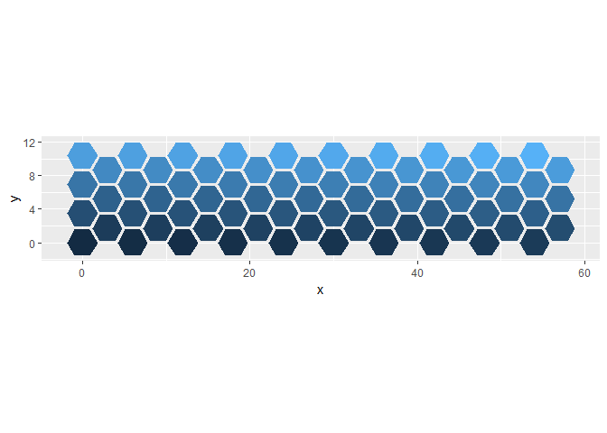
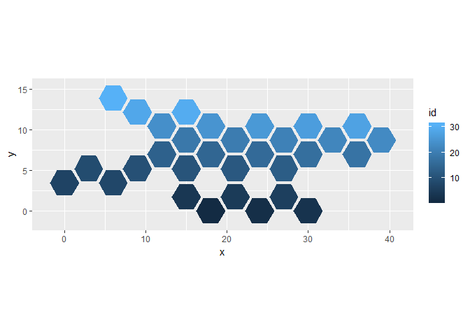
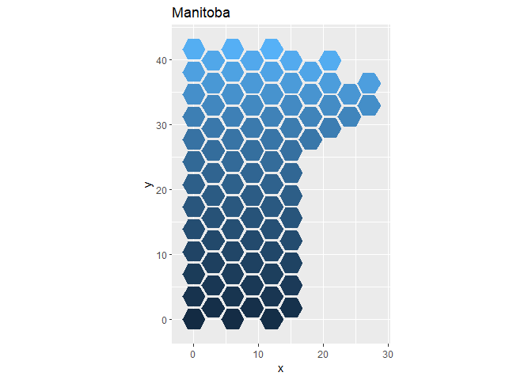

Hexagon Tiles
================
SaewonPark
October 21, 2018

##### Purpose of these functions

I was discussing with my colleague Andrew about representing
administrative districts as hexagonal bins arranged in the shape of a
country or a province (he is making a package for visualizing canadian
data geographically called mapcan). We found that there weren’t any
packages to do this, so I decided to see if I could build a function
that outputs a dataframe with the coordinates of hexagons that can be
fed into geom\_polygon. <br>

-----

##### Hexagons without any space between them

Here is my first attempt. This function arranges hexagons into a
rectangular shape. There is no space between them.

``` r
#function for hexagons without spaces

#length controls the size of the hexagon
#x,y arguments gives the position of the "first" hexagon (from there, hexagons are added to the right and up)

hex.shape <- function(rows, columns, length, x = 0, y = 0){
  x_orig <- numeric(0)
  for (i in 1:rows) {
    if (i %% 2 != 0){
      x_orig <- c(x_orig, seq(x, (columns-1)*(3*length)+x, 3*length))
    }
    else{
      x_orig <- c(x_orig, seq((x+1.5*length), (columns-1)*(3*length)+(x+1.5*length), 3*length))
    }
  }
  y_orig <- numeric(0)
  for (i in 1:rows){
    y_orig <- c(y_orig, rep(y + (sqrt(3)/2)*length*(i-1), columns))
  }
  hex_id <- data.frame(id = seq(rows*columns), x_orig = x_orig, y_orig = y_orig)
  
  hex_shape <- hex_id %>%
  mutate(pt1 = paste0(x_orig+0.5*length, ",",y_orig+(sqrt(3)/2)*length),
         pt2 = paste0(x_orig+1*length, ",",y_orig),
         pt3 = paste0(x_orig+0.5*length, ",",y_orig-(sqrt(3)/2)*length),
         pt4 = paste0(x_orig-0.5*length, ",",y_orig-(sqrt(3)/2)*length),
         pt5 = paste0(x_orig-1*length, ",",y_orig),
         pt6 = paste0(x_orig-0.5*length, ",",y_orig+(sqrt(3)/2)*length)) %>%
  gather(point_id, coordinates, -c(id, x_orig, y_orig)) %>%
  mutate(x = as.numeric(gsub(",.+$", "", coordinates)),
         y = as.numeric(gsub("^.+,", "", coordinates)))
  return(hex_shape)
}


# the output of the function is a dataframe that can be passed into ggplot
  #x_orig and y_orig are the center points of each hexagon
  #id is the id of the hexagon
  #point_id is tells us which corner of the hexagon the coordinates are for (not very useful info)
test_hex1 <- hex.shape(columns = 10, rows = 7, length = 2)

ggplot(test_hex1, aes(x=x, y=y)) +
  geom_polygon(aes(fill = id, group = id)) +
  coord_equal(ratio=1) +
  guides(fill = F)
```

<!-- -->

<br>

##### Hexagons with space between them

Andrew said that hexagonal bins look better when there is space between
them so…

``` r
#function for hexagons with a bit of space
#scale controls the space between hexagons. The range for this value is 0-1, where 1 is no space at all

hex.shape.scale <- function(rows, columns, length, scale, x = 0, y = 0){
  x_orig <- numeric(0)
  for (i in 1:rows) {
    if (i %% 2 != 0){
      x_orig <- c(x_orig, seq(x, (columns-1)*(3*length)+x, 3*length))
    }
    else{
      x_orig <- c(x_orig, seq((x+1.5*length), (columns-1)*(3*length)+(x+1.5*length), 3*length))
    }
  }
  y_orig <- numeric(0)
  for (i in 1:rows){
    y_orig <- c(y_orig, rep(y + (sqrt(3)/2)*length*(i-1), columns))
  }
  hex_id <- data.frame(id = seq(rows*columns), x_orig = x_orig, y_orig = y_orig)
  
  hex_shape <- hex_id %>%
  mutate(pt1 = paste0(x_orig+0.5*length*scale, ",",y_orig+(sqrt(3)/2)*length*scale),
         pt2 = paste0(x_orig+1*length*scale, ",",y_orig),
         pt3 = paste0(x_orig+0.5*length*scale, ",",y_orig-(sqrt(3)/2)*length*scale),
         pt4 = paste0(x_orig-0.5*length*scale, ",",y_orig-(sqrt(3)/2)*length*scale),
         pt5 = paste0(x_orig-1*length*scale, ",",y_orig),
         pt6 = paste0(x_orig-0.5*length*scale, ",",y_orig+(sqrt(3)/2)*length*scale)) %>%
  gather(point_id, coordinates, -c(id, x_orig, y_orig)) %>%
  mutate(x = as.numeric(gsub(",.+$", "", coordinates)),
         y = as.numeric(gsub("^.+,", "", coordinates)))
  return(hex_shape)
}


test_hex2 <- hex.shape.scale(columns = 10, rows = 7, length = 2, scale = 0.9)

ggplot(test_hex2, aes(x=x, y=y)) +
  geom_polygon(aes(fill = id, group = id)) +
  coord_equal(ratio=1) +
  guides(fill = F)
```

<!-- -->

<br>

##### Hexagons arranged in a more customizable manner

``` r
#function for hexagons in customizable dimensions
#col_vector is the vector containing the number of columns per each row. The length of the vector is the number of rows.
#xstart is an optional vector of the starting position of each row. 0 means it starts at the very left.

hex.shape.custom <- function(col_vector, length, scale, x = 0, y = 0, xstart = NULL){
  col_vector <- rev(col_vector)
  if (is.null(xstart)){
  x_orig <- numeric(0)
  for (i in 1:length(col_vector)) {
    if (i %% 2 != 0){
      x_orig <- c(x_orig, seq(x, (col_vector[i]-1)*(3*length)+x, 3*length))
    }
    else{
      x_orig <- c(x_orig, seq((x+1.5*length), (col_vector[i]-1)*(3*length)+(x+1.5*length), 3*length))
    }
  }
  y_orig <- numeric(0)
  for (i in 1:length(col_vector)){
    y_orig <- c(y_orig, rep(y + (sqrt(3)/2)*length*(i-1), col_vector[i]))
  }
  hex_id <- data.frame(id = seq(sum(col_vector)), x_orig = x_orig, y_orig = y_orig)
  
  hex_shape <- hex_id %>%
  mutate(pt1 = paste0(x_orig+0.5*length*scale, ",",y_orig+(sqrt(3)/2)*length*scale),
         pt2 = paste0(x_orig+1*length*scale, ",",y_orig),
         pt3 = paste0(x_orig+0.5*length*scale, ",",y_orig-(sqrt(3)/2)*length*scale),
         pt4 = paste0(x_orig-0.5*length*scale, ",",y_orig-(sqrt(3)/2)*length*scale),
         pt5 = paste0(x_orig-1*length*scale, ",",y_orig),
         pt6 = paste0(x_orig-0.5*length*scale, ",",y_orig+(sqrt(3)/2)*length*scale)) %>%
  gather(point_id, coordinates, -c(id, x_orig, y_orig)) %>%
  mutate(x = as.numeric(gsub(",.+$", "", coordinates)),
         y = as.numeric(gsub("^.+,", "", coordinates)))
  return(hex_shape)
  }
  else{
    x_orig <- numeric(0)
  for (i in 1:length(col_vector)) {
    if (i %% 2 != 0){
      x_orig <- c(x_orig, seq(x + xstart[i]*(3*length),
                              (col_vector[i]-1)*(3*length)+ (x + xstart[i]*(3*length)), 
                              3*length))
    }
    else{
      x_orig <- c(x_orig, seq((x + xstart[i]*(3*length) + 1.5*length), 
                              (col_vector[i]-1)*(3*length) + (x + xstart[i]*(3*length)+1.5*length), 
                              3*length))
    }
  }
  y_orig <- numeric(0)
  for (i in 1:length(col_vector)){
    y_orig <- c(y_orig, rep(y + (sqrt(3)/2)*length*(i-1), col_vector[i]))
  }
  hex_id <- data.frame(id = seq(sum(col_vector)), x_orig = x_orig, y_orig = y_orig)
  
  hex_shape <- hex_id %>%
  mutate(pt1 = paste0(x_orig+0.5*length*scale, ",",y_orig+(sqrt(3)/2)*length*scale),
         pt2 = paste0(x_orig+1*length*scale, ",",y_orig),
         pt3 = paste0(x_orig+0.5*length*scale, ",",y_orig-(sqrt(3)/2)*length*scale),
         pt4 = paste0(x_orig-0.5*length*scale, ",",y_orig-(sqrt(3)/2)*length*scale),
         pt5 = paste0(x_orig-1*length*scale, ",",y_orig),
         pt6 = paste0(x_orig-0.5*length*scale, ",",y_orig+(sqrt(3)/2)*length*scale)) %>%
  gather(point_id, coordinates, -c(id, x_orig, y_orig)) %>%
  mutate(x = as.numeric(gsub(",.+$", "", coordinates)),
         y = as.numeric(gsub("^.+,", "", coordinates)))
  return(hex_shape)
  }
}

test_hex3 <- hex.shape.custom(col_vector = c(1,2,5,5,5,5,2,3,3), xstart = c(3,2,0,0,2,2,2,1,1), length = 2, scale = 0.9)

ggplot(test_hex3, aes(x=x, y=y)) +
  coord_equal(ratio=1) +
  geom_polygon(aes(fill = id, group = id)) 
```

<!-- -->

These are just hexagons arranged in different ways right now, but since
the output is a dataframe with an id for each hexagon, it is possible to
make more meaningful plots. For example, each hexagon could be an
electoral district and the demographic information of all districts
could be easily merged to it.

<br>

-----

For fun, I made the map of Manitoba because I used to live there (and
it’s a pretty easy shape to
make).

``` r
manitoba <- hex.shape.custom(col_vector = c(3,4,4,5,5,5,5,4,4,rep(3,16)), length = 2, scale = 0.9)

ggplot(manitoba, aes(x=x, y=y)) +
  geom_polygon(aes(fill = id, group = id)) +
  labs(title = "Manitoba") +
  coord_equal(ratio=1) +
  guides(fill = F)
```

<!-- -->
